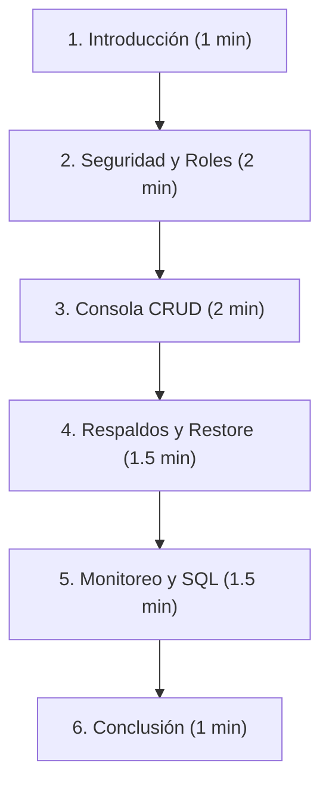

# Guía de Exposición - Sesión 7: Seguridad y Administración de Bases de Datos

Esta guía contiene la estructura del discurso, los puntos clave a destacar y los pasos interactivos que debes realizar en pantalla para lograr una exposición sobresaliente ante el docente y tus compañeros de la **Universidad Privada de Trujillo (UPRIT)**.

---

## 📋 Estructura de la Exposición (Duración: 7-10 Minutos)

---

## 🎙️ Guion Paso a Paso ("Qué Decir" y "Qué Hacer")

### 1. Introducción y Contexto (1 Minuto)
* **Qué hacer en pantalla**: Muestra la página de inicio de la plataforma y haz clic en el módulo **Sesión 7: Seguridad y Admin.** para abrir la consola `SecureDB Corp`.
* **Qué decir**:
  > *"Buenas tardes Mgtr. Susana Caballero y compañeros. El día de hoy el Grupo 5 presentará la solución para la Actividad Formativa N° 7 de Base de Datos, enfocada en la **Seguridad y Administración** de una base de datos corporativa.*
  > 
  > *El propósito de este desarrollo es garantizar la integridad, confidencialidad y disponibilidad de la información de una empresa mediante el control de accesos por roles (RBAC), la gestión CRUD de datos relacionales, la prevención de desastres a través de copias de seguridad, y la auditoría y monitoreo continuo de las operaciones."*

---

### 2. Seguridad y Control de Accesos (2 Minutos)
* **Qué hacer en pantalla**: Ve a la pestaña **1. Seguridad y Acceso**. Cierra la sesión activa si estás conectado. Muestra los "Accesos Sugeridos" en la parte inferior.
* **Qué decir**:
  > *"En primer lugar, abordamos la **Seguridad**. Una base de datos corporativa no puede permitir el acceso irrestricto. Implementamos una validación de usuario y contraseña.*
  > 
  > *Hemos definido 3 roles con privilegios diferenciados:*
  > 1. *El **Administrador** (`admin`), que posee control absoluto sobre los datos y la gestión de usuarios.*
  > 2. *El **Supervisor** (`supervisor`), con capacidad de registrar y modificar información, pero sin permiso de eliminación física.*
  > 3. *El **Usuario Estándar** (`standard_user`), con privilegios mínimos, orientado principalmente a consultas y registros básicos.*
  > 
  > *Ahora, voy a iniciar sesión como **Supervisor** para demostrar cómo el sistema gestiona estas restricciones."* (Haz clic en el botón de acceso rápido de `supervisor`).

---

### 3. Consola CRUD y Control de Privilegios (2 Minutos)
* **Qué hacer en pantalla**: Ve a la pestaña **2. Consola CRUD**. Selecciona la tabla de **Productos**. Intenta eliminar un producto (haz clic en el icono de bote de basura del producto ID 2). Aparecerá la notificación roja de **"Acceso Denegado: Rol Supervisor no tiene privilegios DELETE"**.
* **Qué decir**:
  > *"Aquí vemos la **Consola CRUD**, donde administramos las tablas principales de la empresa: Clientes, Productos, Empleados y Ventas. El sistema simula en tiempo real las consultas `SELECT`, `INSERT`, `UPDATE` y `DELETE`.*
  > 
  > *Como inicié sesión con el rol de **Supervisor**, si intento eliminar un registro de la tabla de productos...* (haz clic en eliminar en vivo) *...el sistema intercepta la transacción, valida que mi rol carece de privilegios `DELETE`, bloquea la operación y lanza una alerta de seguridad. Además, esta infracción se registra automáticamente en la bitácora."*

---

### 4. Copia de Seguridad y Restauración (1.5 Minutos)
* **Qué hacer en pantalla**: Ve a la pestaña **3. Respaldos**. Haz clic en el botón **"Generar Copia de Seguridad"** (verás cómo se agrega un nuevo ítem a la lista con fecha y hora). Luego, simula restaurar haciendo clic en **"Restaurar"** sobre cualquiera de las copias.
* **Qué decir**:
  > *"La administración de bases de datos exige una política de prevención de pérdida de información. En la pestaña de **Respaldos**, permitimos al personal autorizado generar copias de seguridad (Backups) instantáneas de las cuatro tablas principales.*
  > 
  > *Cada copia almacena el estado completo de los datos con marca de tiempo, tamaño en kilobytes y el usuario responsable de su creación. Si ocurriese una falla o borrado accidental, cualquier usuario con rol adecuado puede presionar **Restaurar** para regresar la base de datos al estado exacto guardado en esa fecha y hora."*

---

### 5. Monitoreo, Bitácora y Scripts SQL (1.5 Minutos)
* **Qué hacer en pantalla**: Ve a la pestaña **4. Auditoría y Bitácora**. Muestra el log en pantalla y señala el registro que dice `ACCESS_DENIED` (generado cuando intentaste eliminar el producto hace un momento). Después, pasa rápidamente a la pestaña **5. Scripts SQL**.
* **Qué decir**:
  > *"Para la supervisión del sistema, contamos con un panel de **Monitoreo**. Aquí se puede observar en vivo la bitácora de auditoría (`sys_log`) con cada operación realizada. Noten que el intento fallido de eliminación que realicé hace un momento quedó registrado con estado 'Denegado' y con mi nombre de usuario.*
  > 
  > *Asimismo, para cumplir con los requisitos técnicos, en la sección **Scripts SQL** proveemos el código DDL y DCL listo para correr sobre PostgreSQL o MySQL, incluyendo la creación de tablas, triggers de auditoría automática, creación de usuarios y la asignación de permisos utilizando comandos `GRANT`."*

---

### 6. Conclusión (1 Minuto)
* **Qué hacer en pantalla**: Abre la pestaña **Rúbrica** para mostrar la lista de cotejo completamente cubierta con marcas verdes.
* **Qué decir**:
  > *"Como pueden observar en nuestra Lista de Cotejo de la rúbrica de evaluación, hemos cumplido con el 100% de los lineamientos de la actividad formativa.*
  > 
  > *Este sistema no solo responde a las exigencias académicas del curso de Bases de Datos de la UPRIT, sino que modela fielmente las buenas prácticas de seguridad e infraestructura que se aplican a nivel corporativo hoy en día.*
  > 
  > *Quedamos abiertos a sus preguntas y comentarios. Muchas gracias."*

---

## 💡 Consejos de Éxito para tu Exposición

1. **Usa los Accesos Rápidos**: En lugar de digitar contraseñas durante la exposición, usa los botones de inicio rápido en la sección de login para ahorrar tiempo y evitar errores de escritura en vivo.
2. **Resalta la relación Teoría-Práctica**: Cuando muestres una restricción de permisos en el simulador, menciona conceptos teóricos como **DCL** (Data Control Language) y **Políticas de Privilegio Mínimo**.
3. **Muestra el SQL Descargado**: Si es posible, descarga el archivo SQL durante la presentación y ábrelo en pantalla brevemente para demostrar que no es solo simulación visual, sino que hay código de base de datos real listo para usar.
